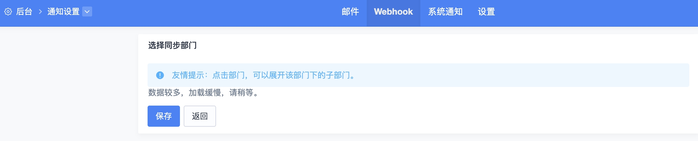
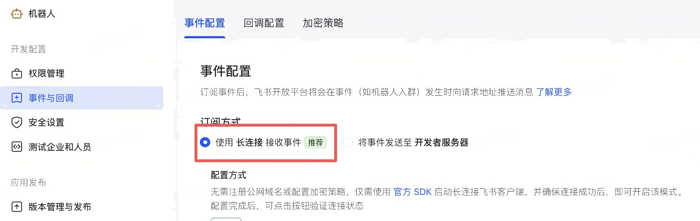

# feishu-bugbot

一套面向 QA 团队的飞书机器人工具集，用大模型把日常测试协作中的重复劳动自动化：

| 入口脚本 | 作用 |
|---|---|
| `bugreport.py` | 飞书群里 @机器人 描述问题（可附截图/视频），大模型判断是否为 bug、整理成结构化报告，并自动在禅道创建 bug，回复禅道链接 |
| `mr_notify.py` | 接收 GitLab Merge Request / 评论的 Webhook，按参与人查找飞书账号并推送通知 |

## 目录结构

```
.
├── bugreport.py              # 飞书提 bug 机器人（长连接模式，无需公网回调地址）
├── analyse.py                # 大模型判断 / 结构化 bug 描述
├── mr_notify.py              # GitLab Webhook -> 飞书通知（Flask 服务）
├── zentao/zentao.py          # 禅道 REST API 封装（登录、创建 bug、上传附件）
├── utils/ark_openai_env.py   # 读取大模型环境变量
├── group_config.example.json # 飞书群 -> 禅道产品映射示例
├── .env.example              # 环境变量说明
└── boot.sh                   # 后台启动 bugreport.py
```

## 快速开始

### 1. 安装依赖

```bash
python3 -m venv venv
source venv/bin/activate
pip install -r requirements.txt
```

### 2. 配置环境变量

```bash
cp .env.example .env
```

按注释填写 `.env`。各脚本用到的变量：

| 变量 | 用途 | 使用方 |
|---|---|---|
| `ARK_API_KEY` / `ARK_BASE_URL` / `ARK_MODEL` | 大模型接口 | 全部 |
| `FEISHU_APP_ID` / `FEISHU_APP_SECRET` | 飞书应用凭证 | `bugreport.py` |
| `ZENTAO_BASE_URL` / `ZENTAO_USERNAME` / `ZENTAO_PASSWORD` | 禅道账号 | `bugreport.py` |
| `ZENTAO_DEFAULT_PRODUCT_ID` | 群未配置或私聊时 bug 落入的默认禅道产品 ID | `bugreport.py` |
| `PRODUCT_NAME` / `PRODUCT_PLATFORMS` / `PRODUCT_DESCRIPTION` / `PRODUCT_USERS` | 提示词中的产品背景 | `bugreport.py` |
| `BUG_CONTACT_NAME` | 机器人回复里提示联系的负责人 | `bugreport.py` |
| `GITLAB_NOTIFY_FEISHU_APP_ID` / `GITLAB_NOTIFY_FEISHU_APP_SECRET` | 通知用飞书应用 | `mr_notify.py` |
| `GITLAB_API_URL` / `GITLAB_PRIVATE_TOKEN` / `GITLAB_SECRET_TOKEN` | GitLab 相关设置 | `mr_notify.py` |
| `COMPANY_EMAIL_DOMAIN` | Webhook 隐藏邮箱时按用户名反查飞书账号 | `mr_notify.py` |

### 3. 飞书通知配置文档

可以在禅道的通知设置里接入机器人，这样当有 bug 的状态变化时机器人会自动通知到相关的责任人，配置文档地址：https://www.zentao.net/book/zentaopms/477.html

之前我自己配置的时候遇到一个问题：在这个页面一直显示加载状态，之后进行了多次尝试发现是飞书机器人的某个权限没有选择导致的，如果有类似问题可以尝试给机器人添加更多的权限



需要添加的权限：

- 消息：`im:message`、`im:message:send_as_bot`、`im:resource`（下载消息中的图片/视频）、`im:chat:readonly`（读取群名）
- 通讯录：`contact:user.base:readonly`、`contact:user.email:readonly`（按邮箱查用户，用于把 bug 指派给被 @ 的同事）

事件订阅：`bugreport.py` 使用 **长连接** 方式接收 `im.message.receive_v1`，无需配置回调 URL，在「事件与回调」中把订阅方式选为「使用长连接接收事件」并添加该事件即可。



发布应用版本后，把机器人拉进需要提 bug 的群或者直接给机器人发消息。

## 使用方式

### 飞书提 bug 机器人

```bash
cp group_config.example.json group_config.json   # 配置群名 -> 禅道产品 ID 与标题前缀，多个产品时才有必要
python bugreport.py                               # 或 ./boot.sh 后台运行
```

`group_config.json` 是「飞书群 -> 禅道产品」的映射表，各字段含义见 `group_config.example.json` 内的说明。群名不在配置中或私聊机器人时，bug 会创建到 `.env` 中 `ZENTAO_DEFAULT_PRODUCT_ID` 指定的产品下，如果你需要同时处理多个产品可以进行相关配置，如果只有一个产品直接在.env里配置对应的产品id即可。

在群里 @机器人 并描述问题，可以在同一条消息里附上截图或视频；如果消息里还 @了某个同事，bug 会指派给对应的禅道账号（按姓名拼音匹配）。

### GitLab MR 通知

```bash
python mr_notify.py        # 监听 0.0.0.0:4500
```

在 GitLab 项目 Webhook 中填写 `http://<host>:4500/webhook/gitlab`，勾选 Merge request events 和 Comments。

## 许可证

[MIT](LICENSE)
